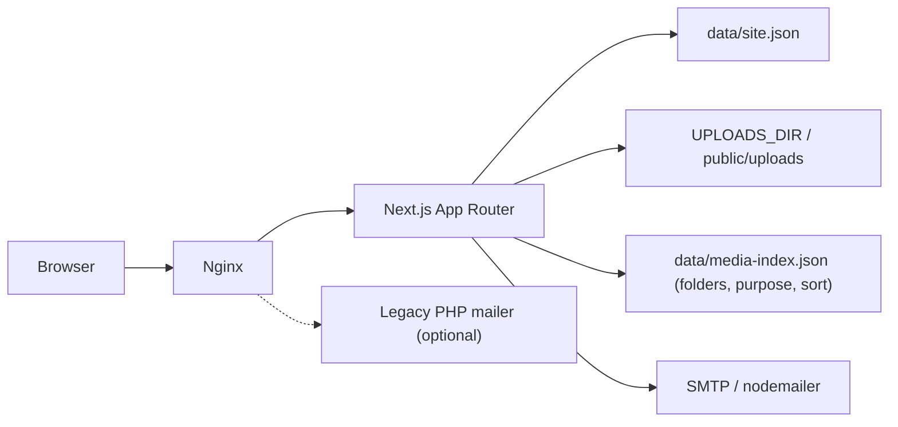
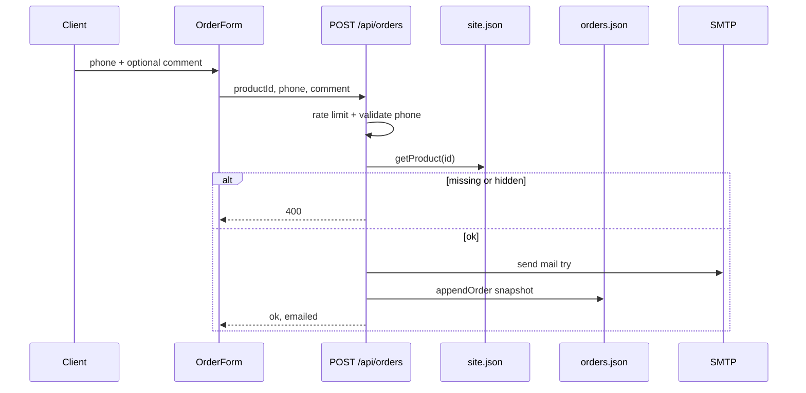

# Architecture

## Overview



## Content model

Весь контент — один JSON-документ `SiteData` (`lib/types.ts`):

- `settings` — title, logo, phones, social, map, `reviewsUrl`…
- `headerMenu`, `servicesNav`, `shopLink`
- `pages[]` — кожна сторінка: `slug`, meta, `sections[]`
- `goods[]` — товари магазину (`Product`: title, price, image, visible, optional `category` / `code`, …)

Окремі журнали (не в `site.json`):

- `data/leads.json` — заявки на дзвінок (`source: callback`)
- `data/orders.json` — замовлення з магазину (`source: shop`, снапшот товару)

Секції типізовані union `Section` (`hero`, `advantages`, `malfunctions`, …).  
Рендер: `SectionRenderer` → компоненти в `components/sections/`.

### Каталог: пошук / фільтри / сортування

Без окремої БД — in-memory над `goods[]`:

- `lib/shop-catalog.ts` — `filterAndSortProducts`, `parseProductSort`, `collectCategories` (+ unit tests)
- Публічний UI: `components/shop/ShopCatalog.tsx` на `/shop` (client toolbar + URL `?q=&sort=&category=`)
- Адмінка: ті самі утиліти в `GoodsEditor` (видимість + view-sort; DnD лише в «чистому» режимі)
- Default sort `manual` = порядок масиву після DnD; `shop-grid` на головній — перші 8 без toolbar

## Data access

`lib/site-data.ts`:

- `DATA_DIR` env або `./data/site.json`
- при відсутності файлу — seed з `lib/default-site-data.ts`
- helpers: pages/products CRUD, unique slug, protect home delete

Single-instance: цілий файл перезаписується при `saveSiteData`. Для multi-replica потрібна БД (поза поточним scope).

## Auth

1. `POST /api/auth` — `verifyPassword` (timing-safe) проти `ADMIN_PASSWORD` + optional TOTP
2. `createSession` — cookie `admin_session` = `token.expiry.hmac`
3. `middleware.ts` захищає `/admin/*` (крім login)
4. API `GET/PUT /api/site`, `POST /api/upload` перевіряють сесію
5. 2FA setup: `GET/POST /api/auth/totp` (session + password re-auth)

Secret: `SESSION_SECRET` (або fallback `ADMIN_PASSWORD` / dev default).

## Public rendering

- `app/page.tsx` — home (`slug === ''`)
- `app/[slug]/page.tsx` — CMS pages
- `app/shop/*` — catalog (`ShopCatalog`: search / sort / category)
- `force-dynamic` — актуальний контент без ISR (file CMS)
- **Feedback carousel** (`FeedbackSection`): CSS grid stack — усі слайди в одній комірці, розмір viewport = max по контенту (найвищий/найширший скрін); перемикання без layout shift. Зображення з `section.images`, CTA «більше відгуків» з `settings.reviewsUrl`.

HTML з CMS проходить `sanitizeHtml()` перед `dangerouslySetInnerHTML`.

## Admin

Client editors (`components/admin/*`) тримають state і зберігають через:

```
PUT /api/site  +  Zod parseSiteData
POST /api/upload
```

Shared helpers: `lib/admin/saveSite.ts`, `lib/admin/uploadImage.ts`, `lib/section-factory.ts`.

## Contact flow

`CallbackForm` → `POST /api/contact` → honeypot `website` → validate UA phone (`380`+9 або `0`+9) → rate-limit → **append lead** (`data/leads.json`, `emailed: false`) → nodemailer (optional) → mark `emailed: true` on success  

Заявки завжди в журналі адмінки `/admin/leads` навіть без SMTP.  
Legacy `mailer/smart.php` лишається в Docker/nginx, але frontend його не викликає.

Маска/placeholder телефону: `+38 (___) ___ __ __` (`lib/phone.ts` → `PHONE_PLACEHOLDER`).

### Service metadata in callback email

Клієнт (форма) додає приховано:

- `pagePath` — `pathname + search` (санітизується на сервері: лише relative `/…`)
- `pageTitle` — `document.title` (обрізається)

Сервер додає в лист на `MAIL_TO` (HTML + text):

| Поле | Джерело |
|------|---------|
| Телефон (`tel:`) | body |
| Час | server `uk-UA` |
| ID заявки | `lead.id` (рядок журналу) |
| Джерело | `callback` |
| Сторінка | `pagePath` + `SITE_URL` якщо задано |
| Заголовок сторінки | `pageTitle` |
| Referer / IP / User-Agent / мова | request headers |
| Посилання на журнал | `SITE_URL/admin/leads` (якщо `SITE_URL`) |

У `leads.json` зберігається `pagePath` (без IP/UA). Subject: `Новий дзвінок з сайту · {phone}`.  
Санітизація path: `lib/page-path.ts`.

### Section render notes

- `advantages` не дублюється: standalone skip, якщо є `malfunctions` або `about-links` (вони інжектять переваги).
- `services-nav` рендериться лише без hero (інакше nav у hero).
- Сторінка товару: лише `OrderForm` + call/messengers (без другої callback-форми).

### Site save concurrency

`SiteData.updatedAt` — optimistic lock. `PUT /api/site` → **409** якщо клієнтська ревізія ≠ серверна.

## Order flow (shop)



- Entry: only product page `/shop/[id]` — `OrderForm` («Замовити»)
- Fields: UA phone (required), comment (optional, max 1000), quantity always **1**
- Server reloads product; rejects invisible/missing; stores **snapshot** (id, title, price, code, image)
- Email to `MAIL_TO` only (shop); journal works without SMTP (`emailed: false`)
- Honeypot field `website` → soft `ok` without persist (same on contact)
- Admin: `/admin/orders` + `GET/PATCH/DELETE /api/orders` (session + IP allowlist at route)
- Store: `lib/orders.ts`, cap 500, atomic write
- Notes: PATCH `note` + UI в Leads/Orders panels

Leads (callback) and orders (shop) are **separate** files and admin sections.

### Health

- `GET /api/health` **public**: `{ ok, service, time, uptimeSec }`
- **Session**: full report (backups, leads, SMTP, Telegram, TOTP, SITE_URL, uploads…) for Dashboard

### Notifications

- Email: nodemailer → `MAIL_TO` (contact + orders)
- Telegram: `TELEGRAM_BOT_TOKEN` + `TELEGRAM_CHAT_ID` (`lib/notify.ts`)
- Admin SMTP test: `POST /api/smtp-test` (session)

### Partial site API

- `PUT /api/site` — full document + `updatedAt` concurrency
- `PATCH /api/site` — `{ section, data, expectedUpdatedAt }` for `goods|settings|headerMenu|servicesNav|pages|shopLink`

### Auth 2FA

- Optional TOTP. Secret resolution: `ADMIN_TOTP_SECRET` env **or** `data/admin-totp.json` (env wins).
- Login body: `{ password, totp }`.
- Admin UI setup: `GET/POST /api/auth/totp` — status / begin (QR) / confirm / disable.
- Confirm flow: generate secret (not stored) → client scans QR → confirm with code + password → write file.
- `lib/totp.ts` + `lib/admin-totp.ts`; QR via `qrcode` package.

## Atomic writes

`lib/atomic-write.ts` — temp file + rename для `site.json`, backups, leads, orders.  
Захист від truncated JSON при crash mid-save.

## Admin shell

- Viewport-locked layout (`admin-shell` 100dvh, `overflow: hidden`): only `admin-main` scrolls; sidebar stays visible.
- Desktop collapse to icons: `AdminShell` + `localStorage` key `admin-nav-collapsed`; labels hidden via `.admin-shell--nav-collapsed`.

## Media

- Upload: `POST /api/upload` → magic bytes + **sharp** optimize (JPEG → WebP; PNG kept; GIF as-is)
- Optional form fields: `preset` (`default` | `product` | `logo` | `hero` | `og`), `maxWidth`, `maxHeight` (clamped 64…4096)
- Presets in `lib/image-presets.ts`:

  | preset | max | use |
  |--------|-----|-----|
  | `default` | 1920×1920 inside | general |
  | `product` | 1200×900 inside | shop cards |
  | `logo` | 512×512 inside | logo / favicon / icons |
  | `hero` | 1920×1080 inside | hero / banners |
  | `og` | 1200×630 inside | social share |

- Client: `lib/admin/uploadImage.ts` + unified `ImageField` (`preset` prop)
- Library: `GET/DELETE /api/media` + `/admin/media` (preset selector on upload)
- Files under `public/uploads/`
- Response may include `width`, `height`, `optimized`, `preset`

## SEO extras

- `LocalBusiness` JSON-LD in `SiteShell`
- Mobile sticky call bar (`StickyCallBar`)

## Rate limits

In-memory sliding window (`lib/rate-limit.ts`), single-instance:

| Endpoint | Limit | UI |
|----------|-------|-----|
| `POST /api/auth` | 10 / хв | LoginForm countdown + disabled submit |
| `POST /api/contact` | 8 / хв | CallbackForm message |
| `POST /api/orders` | 8 / хв | OrderForm message |
| `PUT /api/site` | 30 / хв | `saveSiteData` error string / toast |
| `POST /api/upload` | 20 / хв | `uploadImage` error string |

429 body: `{ error, retryAfter }` + header `Retry-After`. Client helpers: `lib/admin/rateLimitUi.ts`.

## PWA / offline

- `public/manifest.webmanifest` — installable shell
- `public/sw.js` — precache offline page + static assets; network-first for navigations
- `public/offline.html` — fallback when offline
- `components/PwaRegister.tsx` — registers SW (not on `/admin`)
- Admin / API never cached by SW

## E2E smoke

Playwright: `e2e/smoke.spec.ts`, config `playwright.config.ts`.  
`npm run test:smoke` — public pages, health, SEO, PWA assets, admin login, auth 429.
