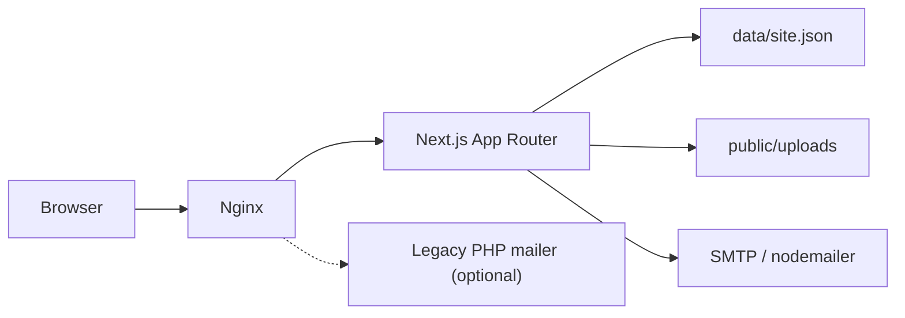

# Architecture

## Overview



## Content model

Весь контент — один JSON-документ `SiteData` (`lib/types.ts`):

- `settings` — title, logo, phones, social, map, `reviewsUrl`…
- `headerMenu`, `servicesNav`, `shopLink`
- `pages[]` — кожна сторінка: `slug`, meta, `sections[]`
- `goods[]` — товари магазину

Секції типізовані union `Section` (`hero`, `advantages`, `malfunctions`, …).  
Рендер: `SectionRenderer` → компоненти в `components/sections/`.

## Data access

`lib/site-data.ts`:

- `DATA_DIR` env або `./data/site.json`
- при відсутності файлу — seed з `lib/default-site-data.ts`
- helpers: pages/products CRUD, unique slug, protect home delete

Single-instance: цілий файл перезаписується при `saveSiteData`. Для multi-replica потрібна БД (поза поточним scope).

## Auth

1. `POST /api/auth` — `verifyPassword` (timing-safe) проти `ADMIN_PASSWORD`
2. `createSession` — cookie `admin_session` = `token.expiry.hmac`
3. `middleware.ts` захищає `/admin/*` (крім login)
4. API `GET/PUT /api/site`, `POST /api/upload` перевіряють сесію

Secret: `SESSION_SECRET` (або fallback `ADMIN_PASSWORD` / dev default).

## Public rendering

- `app/page.tsx` — home (`slug === ''`)
- `app/[slug]/page.tsx` — CMS pages
- `app/shop/*` — catalog
- `force-dynamic` — актуальний контент без ISR (file CMS)

HTML з CMS проходить `sanitizeHtml()` перед `dangerouslySetInnerHTML`.

## Admin

Client editors (`components/admin/*`) тримають state і зберігають через:

```
PUT /api/site  +  Zod parseSiteData
POST /api/upload
```

Shared helpers: `lib/admin/saveSite.ts`, `lib/admin/uploadImage.ts`, `lib/section-factory.ts`.

## Contact flow

`CallbackForm` → `POST /api/contact` → validate UA phone → rate-limit → nodemailer  
Якщо SMTP не налаштовано — log + `{ ok: true, dev: true }`.

Legacy `mailer/smart.php` лишається в Docker/nginx, але frontend його не викликає.
