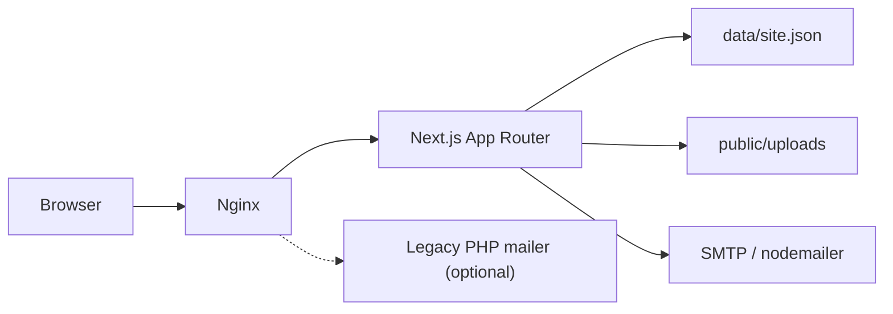

# Architecture

## Overview



## Content model

Весь контент — один JSON-документ `SiteData` (`lib/types.ts`):

- `settings` — title, logo, phones, social, map, `reviewsUrl`…
- `headerMenu`, `servicesNav`, `shopLink`
- `pages[]` — кожна сторінка: `slug`, meta, `sections[]`
- `goods[]` — товари магазину

Секції типізовані union `Section` (`hero`, `advantages`, `malfunctions`, …).  
Рендер: `SectionRenderer` → компоненти в `components/sections/`.

## Data access

`lib/site-data.ts`:

- `DATA_DIR` env або `./data/site.json`
- при відсутності файлу — seed з `lib/default-site-data.ts`
- helpers: pages/products CRUD, unique slug, protect home delete

Single-instance: цілий файл перезаписується при `saveSiteData`. Для multi-replica потрібна БД (поза поточним scope).

## Auth

1. `POST /api/auth` — `verifyPassword` (timing-safe) проти `ADMIN_PASSWORD`
2. `createSession` — cookie `admin_session` = `token.expiry.hmac`
3. `middleware.ts` захищає `/admin/*` (крім login)
4. API `GET/PUT /api/site`, `POST /api/upload` перевіряють сесію

Secret: `SESSION_SECRET` (або fallback `ADMIN_PASSWORD` / dev default).

## Public rendering

- `app/page.tsx` — home (`slug === ''`)
- `app/[slug]/page.tsx` — CMS pages
- `app/shop/*` — catalog
- `force-dynamic` — актуальний контент без ISR (file CMS)

HTML з CMS проходить `sanitizeHtml()` перед `dangerouslySetInnerHTML`.

## Admin

Client editors (`components/admin/*`) тримають state і зберігають через:

```
PUT /api/site  +  Zod parseSiteData
POST /api/upload
```

Shared helpers: `lib/admin/saveSite.ts`, `lib/admin/uploadImage.ts`, `lib/section-factory.ts`.

## Contact flow

`CallbackForm` → `POST /api/contact` → validate UA phone → rate-limit → **append lead** (`data/leads.json`) → nodemailer (optional)  

Заявки завжди в журналі адмінки `/admin/leads` навіть без SMTP.  
Legacy `mailer/smart.php` лишається в Docker/nginx, але frontend його не викликає.

## Atomic writes

`lib/atomic-write.ts` — temp file + rename для `site.json`, backups, leads.  
Захист від truncated JSON при crash mid-save.

## Media

- Upload: `POST /api/upload` → magic bytes + **sharp** optimize (≤1920px, WebP)
- Library: `GET/DELETE /api/media` + `/admin/media`
- Files under `public/uploads/`

## SEO extras

- `LocalBusiness` JSON-LD in `SiteShell`
- Mobile sticky call bar (`StickyCallBar`)

## Rate limits

In-memory sliding window (`lib/rate-limit.ts`), single-instance:

| Endpoint | Limit | UI |
|----------|-------|-----|
| `POST /api/auth` | 10 / хв | LoginForm countdown + disabled submit |
| `POST /api/contact` | 8 / хв | CallbackForm message |
| `PUT /api/site` | 30 / хв | `saveSiteData` error string / toast |
| `POST /api/upload` | 20 / хв | `uploadImage` error string |

429 body: `{ error, retryAfter }` + header `Retry-After`. Client helpers: `lib/admin/rateLimitUi.ts`.

## PWA / offline

- `public/manifest.webmanifest` — installable shell
- `public/sw.js` — precache offline page + static assets; network-first for navigations
- `public/offline.html` — fallback when offline
- `components/PwaRegister.tsx` — registers SW (not on `/admin`)
- Admin / API never cached by SW

## E2E smoke

Playwright: `e2e/smoke.spec.ts`, config `playwright.config.ts`.  
`npm run test:smoke` — public pages, health, SEO, PWA assets, admin login, auth 429.
